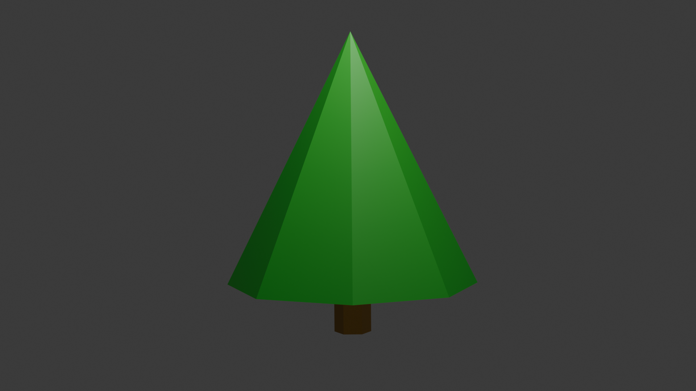

# Art Library
Welcome! Here you will find a collection of my 2D and 3D artworks.

## Table of Contents
- [2D Art](#2d-art)
- [3D Art](#3d-art)
    - [Animations](#animations)
    - [Models](#models)
        - [Characters](#characters)
        - [Environments](#environments)
        - [Props](#props)
- [License](#license)

## 2D Art
There are currently no 2D artworks available.

## 3D Art
### Animations
There are no animations available yet.

### Models
#### Characters
There are no characters models available yet.

#### Environments
There are no environments models available yet.

#### Props
##### [Low Poly Tree](3D/Models/Props/Low-Poly-Tree/)

## Git Mirror

## License
This project is under the Unlicense. For more details, please read the [LICENSE](LICENSE.md) file.
